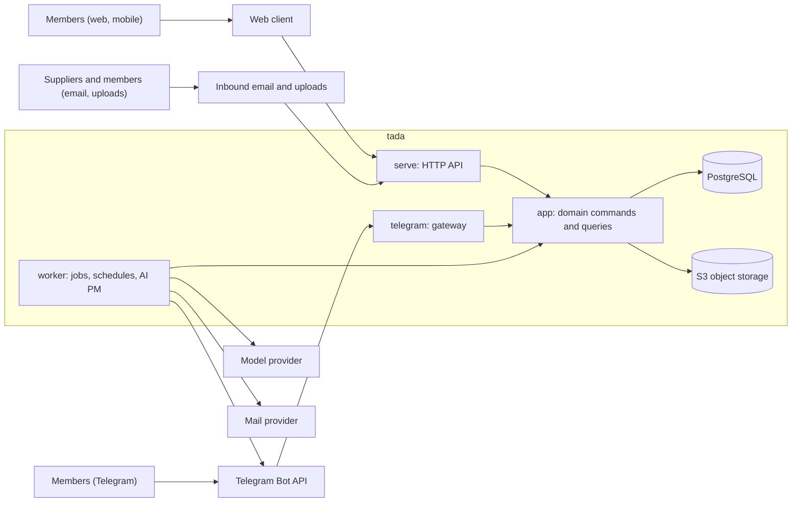

# tada architecture

This document shows how the parts of tada fit together now.
The [ADRs](adr/README.md) contain each decision and its reasons.
If this document and an ADR disagree, the ADR is correct; fix this document.
[PRODUCT.md](PRODUCT.md) describes the users and the scope.

## Context

Optional later adapters: Microsoft Graph (mail, calendar, SharePoint), Nextcloud, ticketing (for example pretix) and club records (CSV first).

## Building blocks

| Block            | Responsibility                                                                                                                       | Decision                                                                                                                               |
| ---------------- | ------------------------------------------------------------------------------------------------------------------------------------ | -------------------------------------------------------------------------------------------------------------------------------------- |
| `domain` crate   | Types, rules and state machines. No I/O.                                                                                             | [0002](adr/0002-monorepo-and-services.md), [0003](adr/0003-runtime-and-tooling.md)                                                     |
| `app` crate      | Domain commands, queries and ports. The only way to change accepted state.                                                           | [0002](adr/0002-monorepo-and-services.md)                                                                                              |
| `store-pg` crate | Repositories, SQL migrations, sessions and the job queue.                                                                            | [0006](adr/0006-persistence.md), [0007](adr/0007-jobs-and-schedules.md), [0008](adr/0008-authentication.md)                            |
| `adapters` crate | Object storage, mail and model provider.                                                                                             | [0009](adr/0009-object-storage.md), [0010](adr/0010-model-provider.md)                                                                 |
| `api` crate      | HTTP handlers, DTOs and the OpenAPI document.                                                                                        | [0017](adr/0017-api-contract-rust.md)                                                                                                  |
| `telegram` crate | Telegram gateway.                                                                                                                    | [0011](adr/0011-telegram.md)                                                                                                           |
| `mcp` crate      | MCP server at `/mcp` for the AI clients of members: read tools with personal API tokens.                                             | [0040](adr/0040-ai-intake-through-mcp.md), [0039](adr/0039-actors-and-identities.md)                                                   |
| `tada` binary    | Composition root. Process roles: `serve`, `worker`, `telegram`. Commands: `migrate`, `bootstrap`, `settings`, `openapi`, `problems`. | [0025](adr/0025-platform-contract.md)                                                                                                  |
| `apps/web`       | React web client, German UI, design system.                                                                                          | [0005](adr/0005-web-client.md), [0018](adr/0018-design-system-foundation.md)–[0024](adr/0024-frontend-quality-gates.md)                |
| Runtime          | One image that follows the platform contract. Each operator deploys it from a separate repository.                                   | [0025](adr/0025-platform-contract.md), [0028](adr/0028-images-and-registry.md), [0033](adr/0033-deployment-outside-this-repository.md) |

Search uses PostgreSQL full-text search first.
pgvector comes only if an evaluation shows a benefit.

## Runtime flows

### A domain command

1. A driving adapter (`api`, `mcp`, `telegram` or `worker`) receives a request and identifies the caller.
2. The adapter calls one `app` command with the caller's capability.
3. The command checks the permissions, the allowed transition and the record version.
4. The command commits the change, the audit event and any outbound job in one transaction.
5. If the record version changed since the caller read it, the command returns a conflict and changes nothing.

### A proposal and its review

1. A connector captures a source item once and stores an immutable source version.
2. The AI extracts a proposal: a patch, source spans, the model and prompt version, assumptions and the target record version.
3. tada routes the proposal to the owner of the workstream, not to the PM.
4. The owner accepts, edits or rejects it. Silence is never acceptance.
5. If the target record changed, the proposal goes into conflict and needs a new evaluation.

### A scheduled reminder

1. The worker finds due checks from accepted state and the configured policy.
2. It stores an outbound intent before the send.
3. The Telegram gateway sends one digest for each person and records the result as sent, failed or unknown.
4. A changed deadline or a completed action cancels obsolete reminders.
5. After a restart, the worker does not send missed reminders in a flood.

## Rules for all parts

### Data ownership

"One system of record" means one authority for each kind of information.
tada does not copy every tool into PostgreSQL.

| Information                                                      | Authority                                                        |
| ---------------------------------------------------------------- | ---------------------------------------------------------------- |
| Accepted actions, decisions, risks, requirements and commitments | tada                                                             |
| Mail messages and threads                                        | The mail provider; tada keeps evidence snapshots and identifiers |
| Working document content                                         | The document tool or tada uploads                                |
| Evidence behind an accepted record                               | An immutable snapshot or an exact retained version               |
| Personal calendar availability                                   | The connected calendar provider, if available                    |
| Published event appointments                                     | The configured calendar owner                                    |
| Tickets, payments and refunds                                    | The ticketing or payment provider                                |
| Posted accounts                                                  | The accounting system                                            |
| AI proposals                                                     | The tada proposal store; never accepted state                    |

### Records and provenance

- Each record has a UUID, an organization ID, an event scope where it applies, an event-local ID, an owner, a status, timestamps and a record version.
- Shared people and resources have organization scope. Event notes and assignments have event scope.
- Source items, source versions, evidence links, proposals and accepted records are separate tables.
- A link to a source is not evidence, because documents change and messages disappear.
  Evidence is the exact source version or a snapshot, with its hash, capture time and a locator such as a page or a passage.
- One domain type holds evidence: `domain::sources::Evidence`, a passage with the ID of its source version.
  Proposals, fact versions and the source links of drafts use it ([ADR 0050](adr/0050-proposals-and-review.md), [ADR 0051](adr/0051-document-drafts-and-provenance.md)).
  A passage of a proposal cites the source text of its changeset by default.
  It can also cite another source version with a text, for example an uploaded text file, if the source version is readable in the event of the proposal (`app::access::event_source_reach`).
  Otherwise the passage could show a text of another event to the members of the event.
  The source links of a draft follow the same rule: they cite only source versions that are readable in the event of the draft.
  A draft version has no source version, so a passage cannot cite a draft.
- Audit messages contain no raw personal data.
- [doc/data-inventory.md](data-inventory.md) lists each category of personal data that tada stores.
- Retention and deletion rules cover originals, snapshots, extracted facts, embeddings and backups.

### Permissions and isolation

- Organization isolation applies to all reads, writes, jobs, search, citations and exports.
  [ADR 0006](adr/0006-persistence.md) defines how the database enforces it.
- Event permissions apply inside the organization boundary.
- Permission filtering happens before retrieval, so AI answers and citations never contain data the caller cannot see.
- Owners and admins read each source version of their organization.
  Another member reads the source versions of the events in which the member has an event role, and the source versions that the facts and proposals of these events cite as evidence.
  For example, the text of an organization changeset has no event, and the members of the event that it creates read it through the evidence.
  `app::access::source_reach` holds this rule. Search and the reads of citations use it.
  A new citation in a proposal or a draft uses the reach of its own event (`app::access::event_source_reach`).
- A document copied into an event does not widen access. Both the source access and the event membership must allow disclosure.
- Unknown event attribution goes to a triage queue. AI can suggest an event, but it never shows a message to more than one event team on its own.

### AI authority

AI helps with extraction, matching, agendas, summaries, draft replies, consistency checks and questions with sources.
Rules and database queries do counting, deadlines, permissions, reservation overlaps and state transitions.
[ADR 0010](adr/0010-model-provider.md) limits AI tools to queries and proposals.

| Action class                                                              | Default handling                                                       |
| ------------------------------------------------------------------------- | ---------------------------------------------------------------------- |
| Ingest, deduplicate and index authorized sources                          | Automatic                                                              |
| Personal draft, summary or suggested label                                | Automatic within the granted scope                                     |
| New commitment, decision or requirement, or a consequential status change | Review by the named owner                                              |
| Repeated low-impact workflow                                              | Automatic only through an explicit rule with an audit record           |
| Internal Telegram reminders and check-ins                                 | Automatic under a configured policy, for verified members who opted in |
| Supplier or public communication, spend or calendar invitation            | Explicit authority and the applicable approval policy                  |
| Aviation safety, emergency command and operating approval                 | An accountable, qualified person                                       |

- Documents and emails are untrusted input. Extraction cannot run tool instructions.
- New suppliers, changed bank details or changed recipients never become accepted because an email says so.
- Confidence scores sort the review work. They never grant permission.
- AI answers separate accepted state, proposals, historical state and inference, and show the freshness of each source.
- Approved aviation packs come from deterministic rendering of approved fields. AI can draft text before approval, but it never writes published routes or instructions.
- The evaluation set includes contradictory dates, conditional promises, German and English messages, duplicate emails, wrong-event routing, malicious instructions, private sources and missing evidence.

### Integrations

- Every adapter has scoped authentication, capability metadata, checkpoints, source IDs and versions, deterministic mappings, incremental retrieval, reconciliation, revocation handling and diagnostics.
- A webhook only signals that something can have changed. A worker then fetches and reconciles the authoritative data.
- Delivery is at least once, and processing is idempotent. Deduplication uses the organization, the connection, the resource and the version.
- A checkpoint moves only after durable capture.
- Most data flows into tada. If two systems change the same field, tada shows a conflict; it never uses blind last-write-wins.
- Integration health is a product feature: last sync, permission expiry, backlog and stale sources are visible. "No new mail" must never hide "the connector is disconnected".
- A failure goes to the named integration owner, not to the PM.
- Microsoft Graph: test the real permission model in the club tenant before any promise. A folder selected in the UI does not limit a broad API token.

### Documents

- A document has a stable tada ID. Its name, folder and provider can change.
- Each version records its hash, provider reference, uploader, timestamps, classification and processing status.
- States: draft, review, approved, superseded and archived. Approval applies to one exact version. An edit creates a new draft.
- A change of accepted facts marks dependent documents for review. It never rewrites an approved document.
- Generated drafts store the exact fact versions and source versions that they used.
- tada shows unsupported pages and formats explicitly. OCR text alone cannot check traffic capacity, evacuation geometry or aviation safety.
- The first formats: Markdown concepts, PDF preview and export, text PDFs and selected office files. Specialist formats stay downloadable originals.
- A move to another storage provider keeps document IDs, version IDs, hashes and approvals, with a tested mapping manifest.
- In Slice 1, each document belongs to exactly one event, and access follows the event role ([ADR 0052](adr/0052-event-roles-and-ownership.md)).
  The `DOC` numbers stay unique in the organization ([ADR 0038](adr/0038-ids-and-time.md)).
  Documents of the whole organization need a later ADR, because no access rule for them exists yet.
- Each organization has a storage quota: the column `organization.storage_quota_bytes`, 5 GiB by default ([ADR 0043](adr/0043-upload-policy.md)).
  It is a value in the database, not an environment setting. An operator changes it for one organization with SQL.
- The text of an uploaded plain text, Markdown or CSV file is the text of its source version: members can search and cite it ([ADR 0050](adr/0050-proposals-and-review.md)).
  A proposal can cite a passage of such a file as its evidence.
  PDF and office files have no extracted text yet. An agent cites its own source text for facts from such files.
- tada keeps the text of a text file up to 1 MiB only. This cap limits the memory of each upload. tada stores a larger text file without its text: members cannot search or cite it, and the file stays downloadable.
  The PostgreSQL search index of one text is limited to 1 MB, and the index of a text with many unique words can be larger than the text.
  If the index of a text under the cap is too large, tada stores the version without searchable text.
- The source text of a changeset has at most 100,000 characters after the normalization, else the request fails with `validation-failed`.
  The cap keeps the search index of the text under its limit, and it limits the cost of the passage checks, which read the text.
- An upload is a raw request body with the media type `application/octet-stream`, not a multipart form.
  The header `X-File-Name` holds the file name, percent-encoded as UTF-8.
  The server then streams the body to the object storage without a form parser.
- The upload routes read the body as a stream, so the default body limit of `axum` does not apply to them.
  They apply `TADA_UPLOAD_MAX_BYTES` instead ([ADR 0043](adr/0043-upload-policy.md)): a larger `Content-Length` fails at once, and the upload counts the bytes of the stream.
  All other routes keep the default limit of `axum`.
- A download sends `Content-Disposition` with the RFC 6266 file name, `X-Content-Type-Options: nosniff`, `Content-Security-Policy: default-src 'none'; sandbox`, `Cross-Origin-Resource-Policy: same-origin` and `Cache-Control: private, no-store` ([ADR 0009](adr/0009-object-storage.md)).
  Only PDF and plain text can be inline. Each other type is an attachment, also if the client asks for inline.
- A draft has at most 200,000 characters of Markdown ([ADR 0051](adr/0051-document-drafts-and-provenance.md)).
  A concept of an event has some ten thousand characters. The limit bounds the size of one proposal.

### Safe evolution

- Schema changes follow expand and contract ([ADR 0006](adr/0006-persistence.md)). A migration never turns an assumption into a decision.
- API contracts, document schemas, extraction output, templates, automation policies and job payloads have versions.
- Operators rehearse a release on restored data before production. Their deployment repository defines how ([ADR 0033](adr/0033-deployment-outside-this-repository.md)).
- Regression fixtures cover small events, the large-event concept, cross-channel changes, document approvals, isolation and old job payloads.
- Exports contain versioned JSON and CSV, originals, retained versions, hashes and relationship manifests. A test rebuilds the data from an export.
- The production AI PM changes records only through approved tools. It cannot change its own code or the database schema.
- Embeddings can be rebuilt. Accepted decisions never come from chat history.
- A release gate checks existing events, files, concept regeneration, access isolation and old jobs.

## Options not used now

These tools were checked on 6 October 2026. They are optional adapters or alternatives, not dependencies.

| Tool                                                 | Possible role                                               |
| ---------------------------------------------------- | ----------------------------------------------------------- |
| [Nextcloud](https://nextcloud.com/files/)            | A storage adapter through WebDAV, if a club already uses it |
| [Paperless-ngx](https://docs.paperless-ngx.com/api/) | An archive alternative, if archival needs dominate          |
| [NanoClaw](https://github.com/nanocoai/nanoclaw)     | An agent runtime; only if a measured need justifies it      |
