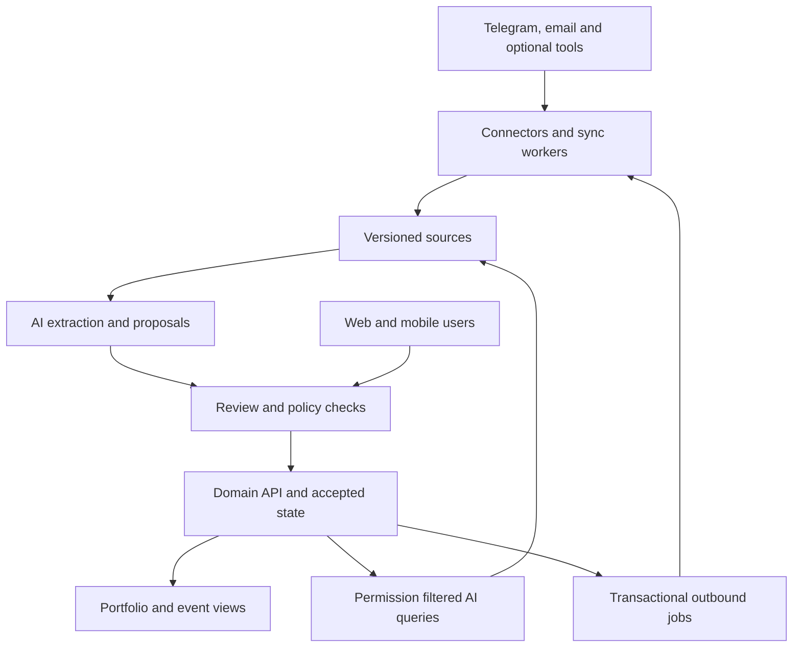

tada starts with a compact application, PostgreSQL, private object storage, a built-in file browser and independent member authentication. Web and Telegram call the same authorized domain tools. Nextcloud, Microsoft and alternative agent runtimes are optional later adapters.

## Data ownership and provenance

“One system of record” means one authority for each kind of information, not copying every tool into Postgres.

| Information                                                            | Authority                                                                        |
| ---------------------------------------------------------------------- | -------------------------------------------------------------------------------- |
| Accepted event actions, decisions, risks, requirements and commitments | tada                                                                             |
| Mail messages and threads                                              | Existing mail provider; tada retains approved evidence snapshots and identifiers |
| Working document content                                               | Existing document tool or tada uploads                                           |
| Evidence used to justify an accepted record                            | Immutable, versioned snapshot or exact retained version with approved retention  |
| Personal calendar availability                                         | Connected calendar provider, if available                                        |
| Published event appointments                                           | The explicitly configured calendar owner                                         |
| Tickets, payments and refunds                                          | Ticketing/payment provider                                                       |
| Posted accounts                                                        | Accounting system                                                                |
| AI proposals                                                           | tada proposal store; never accepted state until the applicable rule approves     |

A source link alone is insufficient: documents change and messages may be deleted. Retain the exact source version or a permitted immutable snapshot, hash, capture time and locator such as page, paragraph or message passage.

Minimum shared fields: UUID, organization ID, event scope where applicable, human-readable event-local ID, owner, status, timestamps and record version. Shared club people and resources use organization scope; event-specific notes and assignments use event scope.

Separate SourceItem, SourceVersion, EvidenceLink, Proposal and accepted domain records. A proposal includes the proposed patch, source spans, extraction/model version, assumptions, reviewer and target record version.

Do not put raw personal information into general audit messages. Retention/deletion rules must cover originals, snapshots, extracted facts, embeddings and backups; evidence preservation is bounded by those rules.

AI answers retrieve accepted records and authorized evidence at request time. They distinguish accepted state, proposals, historical state and inference, and show source freshness. “No new mail” must never mean “the connector is disconnected.”

Permission filtering happens before retrieval and applies to citations and source excerpts. Source access and event membership must both permit disclosure; copying a private document into an event does not silently broaden access.

## Proposed architecture

Start with a modular monolith and a background worker sharing one codebase. This keeps operations compact while preserving clear module boundaries.

### Starting stack to validate

- TypeScript, React/Next.js and a server-side domain API with an OpenAPI contract.
- PostgreSQL for accepted state, relationships, proposals, audit events and a durable job queue.
- Object storage for retained source snapshots and generated exports.
- Independent application identities: invited personal email with short-lived, single-use sign-in links, optionally passkeys. Telegram identities are linked through expiring invitation codes and verified membership; Entra/OIDC is optional later. No paid Microsoft seat is required for tada participation.
- PostgreSQL full-text search first; add pgvector if evaluation shows useful semantic retrieval.
- One model-provider adapter with schema-validated output, usage accounting and model/version tracking.
- Two deployable processes, web/API and worker; no microservices, Kafka or graph database initially.

These are proposed implementation choices, not purchased services. A hosting decision requires a priced deployment plan and an operator responsible for backups and updates.

### Domain integrity

Use relational tables and explicit foreign keys for the stable core; use schema-validated JSON only for bounded extensions. Organizational isolation applies to all reads, writes, jobs and exports. Event-level permissions sit within that boundary.

All mutations go through domain commands, including AI and connector updates. Validate ownership, allowed transitions and optimistic record versions. Commit the accepted change, audit event and outbound job atomically. If the record changed since a proposal was created, require re-evaluation rather than overwriting it.

API keys or a future MCP facade expose these same authorized commands. MCP is an optional assistant interface, not the internal persistence layer or a substitute for background connectors.

## Integration design

The first integration is Telegram. Begin email/document capture with uploads and a per-event inbound email address that members can forward or copy messages to. This needs no Microsoft tenant integration; automatic forwarding may still be restricted by the mail provider. Supply a manual fallback. tada cannot observe messages or document changes it has not received. Microsoft Graph integration is optional later, when actual permissions and admin availability are proven.

Codex must prove the actual Graph permission model in the club tenant. Delegated permissions and application permissions differ, and shared-resource scenarios have specific limitations. Never assume selecting a folder in the UI technically limits a broad API token. Document token privileges and enforce the configured boundary in the application.

| Connector                     | Inbound first                                          | Outbound later                                          |
| ----------------------------- | ------------------------------------------------------ | ------------------------------------------------------- |
| Telegram                      | Commands, direct replies and authorized button actions | Policy-controlled internal reminders and briefings      |
| Inbound email/uploads         | Forwarded/copied messages and document versions        | Drafts and exports                                      |
| Outlook mail, optional        | Selected messages, threads and attachments             | Drafts first; controlled sending                        |
| SharePoint/OneDrive, optional | Selected document versions and metadata                | Approved generated packs and reports                    |
| Calendar                      | Selected events and permitted availability             | Explicitly owned appointments; reconcile external edits |
| Teams                         | Linked/uploaded minutes initially                      | Notifications after tenant and API capability checks    |
| Ticketing                     | Registration/order status when needed                  | Usually keep checkout in the provider                   |
| Club records                  | CSV import/export initially                            | API only after availability and ownership are verified  |

Every adapter must provide scoped authentication, capability metadata, checkpoints, source IDs/versions, deterministic mappings, incremental retrieval, reconciliation, revocation handling and diagnostics.

Webhooks signal that something may have changed. Workers fetch and reconcile authoritative data. Renew subscriptions before expiry, honor provider rate limits, retry transient failures and surface terminal failures. Periodic reconciliation repairs missed notifications. Persist checkpoints only after durable capture.

Use at-least-once delivery with idempotent processing. Dedupe by organization, connection, resource and version; dedupe outgoing commands separately. Preserve thread identity and attachment relationships. Track sync origin to prevent feedback loops.

For the first release, most data flows one way into tada. Outbound fields have explicit ownership. If both systems edit the same field, flag the conflict rather than using blind last-write-wins.

Unknown event attribution goes to a triage queue. AI may suggest an event but must not silently expose a message to multiple event teams. Shared evidence requires explicit scope.

Integration health is a product feature: last successful sync, permission expiry, backlog, stale sources and reauthentication requests are visible. Failure routes to a named integration owner, not automatically to the PM.

## Simple storage and authentication baseline

The product is named **tada**.

### Built-in file browser

Provide folders, upload/drag-and-drop, filename search, metadata, PDF/image/text preview, download, version history and links to event records. Start without browser Office editing, desktop sync or public sharing. Users can download/edit/re-upload office files; each upload creates a new version.

PostgreSQL owns folders, document/version IDs, titles, event scope, ownership and processing state. Object storage holds originals, previews and extracted outputs under generated keys unrelated to filenames. A rename or move updates metadata rather than changing identity.

The bucket is private. Authorize each upload/download server-side before issuing a short-lived URL. Presigned URLs are bearer credentials and may be reusable until expiry; never treat them as one-time user-authenticated links. See [S3 presigned URLs](https://docs.aws.amazon.com/AmazonS3/latest/userguide/using-presigned-url.html).

Issue uploads to a unique staging key. Finalize after verifying the uploaded object, size/type and expected scope; reject unsafe previews and oversized uploads. Publish a version atomically in the database only after capture succeeds. Approved/retained blobs cannot be overwritten by a reused upload URL. Track abandoned uploads, orphaned objects and failed extraction; clean them using an explicit policy. For stricter immediate revocation, proxy downloads through the authenticated application instead of handing out signed URLs.

Copying a UI component can save frontend work, but check its license and maintenance. Do not copy an entire file manager that brings a second identity or metadata system.

### Authentication now

Use a maintained library rather than implementing token/session cryptography. Better Auth is a candidate with documented magic-link and organization plugins; pin and test a suitable release. See [Magic links](https://better-auth.com/docs/plugins/magic-link) and [Organizations](https://better-auth.com/docs/plugins/organization).

Invite-only access: the owner invites an existing personal email address. A short-lived, single-use email link signs the member in and creates a revocable secure session. Disable unrestricted signup and do not grant membership merely because an email domain matches. Use secure HTTP-only cookies, request/redirect validation and rate limits provided/configured through the library. Transactional email delivery is a small explicit dependency to price and operate.

Internal records: User, ExternalIdentity, OrganizationMembership and EventMembership. Use stable user UUIDs; email, Telegram ID and future Microsoft identities are linked credentials, not primary keys.

Organization roles: owner/admin/member. Event roles: manager/contributor/viewer, with scoped workstream ownership. Authorization stays in domain commands, not solely in UI buttons or authentication-provider claims.

### Telegram linking and future access

A logged-in member requests a short-lived single-use link code, starts the bot and confirms the binding. Verify both application membership and stable Telegram user ID; never use a display name as identity. Incoming actions recheck current membership, role and record version. AI runs with the caller's scope; scheduled jobs use a named limited service identity.

Revoking membership blocks both web and bot actions and revokes sessions. Provide unlinking/recovery through verified email or documented owner assistance with an audit record. No shared OK login and no Microsoft seat requirement.

Later add passkeys/step-up authentication for privileged actions and Google/Microsoft OIDC if useful. These attach to the same User ID. No separate identity server or enterprise SSO deployment is needed for the PoC. Full membership and identity exportability remain requirements.

## Hosted documents and AI working environment

Documents are first-class records: Verkehrsplan, site drawings, budget sheets, minutes, authority correspondence and generated concepts are stored, browsable and linked to event records. Users open/download them without asking AI.

Three durable layers:

1. PostgreSQL stores accepted event facts, assumptions, open questions, owners and relationships.

2. A document workspace stores editable originals, folders, metadata and versions.

3. A rebuildable AI index stores extracted text, OCR, page references and optional embeddings.

Desktop/web, Telegram and later WhatsApp use the same authorized tada API. Conversations may differ; accepted state is shared according to permissions. Hosted workers operate when the user's laptop is off.

### Open-source candidates

| Candidate     | Relevant capabilities                                                                                                        | Proposed role                                                      |
| ------------- | ---------------------------------------------------------------------------------------------------------------------------- | ------------------------------------------------------------------ |
| Nextcloud     | Open-source file workspace, browser access, sharing, versions and documented WebDAV access; Assistant supports document work | Future optional adapter; not deployed in the PoC                   |
| NanoClaw      | MIT-licensed containerized agent runtime, channel adapters and scheduled tasks                                               | Optional future runtime; not a PoC dependency                      |
| Paperless-ngx | Document ingestion/search and documented REST API                                                                            | Archive-focused alternative to evaluate if archival needs dominate |

Sources checked 6 October 2026: [Nextcloud Files](https://nextcloud.com/files/), [WebDAV](https://docs.nextcloud.com/server/latest/developer_manual/client_apis/WebDAV/index.html), [Versions](https://docs.nextcloud.com/server/latest/user_manual/en/files/version_control.html), [Assistant](https://nextcloud.com/assistant/), [NanoClaw](https://github.com/nanocoai/nanoclaw), [Paperless API](https://docs.paperless-ngx.com/api/). These establish advertised capabilities, not a tested deployment.

Use a built-in file browser backed by private S3-compatible object storage and PostgreSQL metadata. No Nextcloud or Paperless deployment in the PoC. Reuse suitably licensed UI components, but keep permissions and file lifecycle in the application backend.

The application has one identity system for browsing files, event records and AI interaction. Future Nextcloud/Microsoft connectors may link external identities without changing internal user or document IDs.

NanoClaw is not a PoC dependency. Its channel adapters, container isolation and scheduling can save work for a broad personal assistant, but the first event workflow needs only a web interface, Telegram adapter and a narrow AI worker. The domain API, identity, versioned documents, review rules and migration discipline still need implementing. Reconsider NanoClaw only when a measured need justifies its additional runtime and customization burden. Its advertised WhatsApp support does not establish an official WhatsApp Business integration.

### Document lifecycle and AI tools

Each Document has a stable tada ID independent of name, folder or provider. Each version records content hash, provider reference, author/uploader, timestamps, classification and processing status. States include draft, review, approved, superseded and archived. Approval applies to an exact version. Editing creates a new draft.

Folder moves preserve IDs. Referenced versions must be retained under an explicit policy; ordinary file-version history alone does not guarantee permanent evidence retention.

AI tools list/search files, retrieve authorized versions, inspect linked facts, draft documents and propose revisions. Save drafts with the exact fact/source versions used. A change to accepted facts flags dependent documents for review; it does not silently rewrite approved documents.

For a Verkehrsplan, AI can draft explanatory text, extract issues and compare versions. Geometric checks need usable image/CAD/GIS input and demonstrated capabilities. OCR text alone cannot validate traffic capacity, evacuation geometry or aviation safety. Show unsupported pages/formats explicitly.

Begin with editable Markdown concepts, PDF preview/export, text PDFs and selected office-file extraction. Specialist formats remain downloadable originals. Do not claim unsupported editing or analysis.

Define a storage adapter for reading/writing blobs and a separate document service for IDs, metadata, versions, permissions, folders and approval state. The first storage adapter is private S3-compatible object storage. Nextcloud or OneDrive/SharePoint may follow. Migration preserves document/version IDs, hashes and approvals, with a tested mapping manifest.

## AI and automation policy

AI helps with extraction, matching, agendas, summaries, draft replies, consistency checks and source-backed questions. Rules and database queries perform counting, deadlines, permissions, reservation overlaps and state transitions.

| Action class                                                         | Default handling                                                   |
| -------------------------------------------------------------------- | ------------------------------------------------------------------ |
| Ingest, deduplicate, index authorized sources                        | Automatic                                                          |
| Personal draft, summary, suggested label                             | Automatic within granted scope                                     |
| New commitment, decision, requirement or consequential status change | Named owner review                                                 |
| Repeated low-impact workflow                                         | May automate through an explicit, auditable rule                   |
| Internal Telegram reminders and check-ins                            | Automatic under a configured policy for verified, opted-in members |
| Supplier/public communication, spend or calendar invitation          | Explicit authority and applicable approval policy                  |
| Aviation safety, emergency command and operating approval            | Accountable qualified human authority                              |

Avoid one approval queue owned by the PM. Route proposals by event and workstream, support batch review and escalate only unowned or overdue items. Record why an automation rule permitted a change. Confidence scores are triage hints, not permission grants.

Treat documents and emails as untrusted inputs. Extraction cannot execute tool instructions. AI receives narrow tools, permission-filtered data and output validation. New vendors, changed bank details or altered recipients are never accepted merely because an email says so.

Approved aviation packs should use deterministic rendering from approved fields and versioned operational text. AI may help draft text before approval; it cannot improvise published routes or instructions.

A minimal evaluation set must include contradictory dates, conditional promises, German and English messages, duplicate emails, wrong-event routing, malicious instructions, private sources and missing evidence.

## Safe evolution during event planning

Versioned migrations and stable interfaces make changes testable and recoverable; they cannot guarantee zero breakage.

- Add fields/tables first, backfill, support old/new representations during transition, and remove old forms in a separate release.

- Version API contracts, document schemas, extraction output, templates and automation policies. Persist job payload versions and handle or migrate old queued jobs explicitly.

- Preserve UUIDs and semantics. A migration cannot turn an assumption into an approved decision.

- Rehearse upgrades on a staging restore of populated planning data. Test documents, permissions, queries and important workflows.

- Back up database and files consistently with a manifest. Test restoration. Code rollback alone may not reverse a data migration; define a roll-forward or restore plan.

- Retain regression fixtures for small events and the Dübendorf concept, cross-channel changes, document approvals, isolation and old payloads.

- Use feature flags and separate development/staging from the live project. Pin dependencies and record architecture decisions in Git.

- The production AI PM changes records through approved tools; it cannot change its own deployed code or database schema. Codex development follows review, tests and deployment.

- Export versioned JSON/CSV plus originals, retained file versions, hashes and relationship manifests. Demonstrate reconstruction.

Use a bounded typed core and schema-validated extensions for experiments. Promote stable concepts through migrations. Embeddings are rebuildable; accepted decisions are not reconstructed from chat.

A release gate checks existing events, browsable files, sourced concept regeneration, access isolation and handling of old jobs.
