# Deployment

This document describes how tada runs, how a release reaches production and who does each step.
The ADRs 0015, 0016 and 0025–0032 contain the decisions and their reasons.
This document contains no host addresses. The scripts read them from `deploy/inventory.local`, which Git ignores.

## Principles

- The app knows nothing about its runtime. It follows the [platform contract](../adr/0025-platform-contract.md).
- All knowledge about the runtime is in `deploy/`.
- Scripts do every operation. An agent can run most of them; a person approves production changes.
- Each script is idempotent. A second run with the same input changes nothing.

## Topology

```mermaid
flowchart LR
  U["Members (browser)"] -->|HTTPS| C
  T["Telegram"] -->|webhook HTTPS| C
  subgraph VM["VM: Docker Compose"]
    C["Caddy (ports 80, 443)"]
    subgraph P["production project"]
      S["tada serve"]
      W["tada worker"]
      G["tada telegram"]
      DB[("PostgreSQL")]
      O[("Garage S3")]
    end
    subgraph R["staging project (only during a rehearsal)"]
      S2["tada serve"]
      DB2[("PostgreSQL")]
      O2[("Garage S3")]
    end
    C --> S
    C --> G
    C --> S2
    S --> DB
    S --> O
    W --> DB
    W --> O
    G --> DB
    S2 --> DB2
    S2 --> O2
  end
  W -->|restic| B[("Backblaze B2 (EU)")]
  GH["GitHub Actions"] -->|image| GHCR[("GHCR")]
  GH -->|forced-command SSH| VM
  VM -->|pull by digest| GHCR
```

DNS (Cloudflare, "DNS only"):

| Name                        | Target        | Purpose            |
| --------------------------- | ------------- | ------------------ |
| `tada.zaruba.email`         | production VM | production         |
| `staging.tada.zaruba.email` | production VM | staging rehearsals |

The product owner confirms these names before the first deploy.

## Hosts

| Host                    | Data               | Use                                      |
| ----------------------- | ------------------ | ---------------------------------------- |
| existing shared VPS     | invented data only | walking skeleton, Slice 1 demonstrations |
| dedicated production VM | real data          | production and staging rehearsals        |

Real personal data never enters the shared VPS ([ADR 0026](../adr/0026-first-runtime.md)).

## Portability mapping

The same image runs on each platform. Only the manifests in `deploy/` change.

| Concern         | Docker Compose (now)        | Kubernetes                                      | Google Cloud Run                          |
| --------------- | --------------------------- | ----------------------------------------------- | ----------------------------------------- |
| Role `serve`    | service                     | Deployment and Service                          | service                                   |
| Role `worker`   | service                     | Deployment                                      | worker pool or service with CPU always on |
| Role `telegram` | service                     | Deployment and Service                          | service                                   |
| `tada migrate`  | `docker compose run --rm`   | Job, before the rollout                         | Job                                       |
| TLS and routing | Caddy                       | Ingress controller and cert-manager             | managed HTTPS                             |
| Settings        | `environment:`              | ConfigMap                                       | environment variables                     |
| Secrets         | `secrets:` files            | Secret, mounted as files                        | Secret Manager, mounted as files          |
| PostgreSQL      | container with a volume     | operator (for example CloudNativePG) or managed | Cloud SQL                                 |
| Object storage  | Garage                      | Garage, or a managed S3 service                 | Cloud Storage (S3 interoperability)       |
| Health checks   | `healthcheck:` on `/readyz` | liveness `/healthz`, readiness `/readyz`        | startup and liveness probes               |
| Logs            | `docker logs` (JSON)        | cluster log collector                           | Cloud Logging                             |
| Backups         | restic job on the host      | CronJob                                         | Cloud Scheduler and a Job                 |

## First setup

The owner column shows the steps that need the product owner.

| Step                                                                                       | Who   | Command or action                            |
| ------------------------------------------------------------------------------------------ | ----- | -------------------------------------------- |
| 1. Confirm the hostnames                                                                   | owner | reply in the pull request                    |
| 2. Create the dedicated VM (before real data)                                              | owner | Hetzner console, EU location, Ubuntu LTS     |
| 3. Set the Hetzner Cloud Firewall: 22, 80, 443 inbound                                     | owner | Hetzner console                              |
| 4. Write `deploy/inventory.local`                                                          | owner | host name and SSH user                       |
| 5. Check the planned host changes                                                          | agent | `mise run host:provision -- --dry-run`       |
| 6. Provision the host                                                                      | owner | `mise run host:provision`                    |
| 7. Create the DNS records ("DNS only")                                                     | owner | Cloudflare dashboard                         |
| 8. Create the B2 bucket and the two keys (append-only for the VM, full for pruning)        | owner | Backblaze console                            |
| 9. Set all secrets from the password manager                                               | owner | `mise run secrets:set <environment> <name>`  |
| 10. Check that all secrets exist                                                           | agent | `mise run secrets:check <environment>`       |
| 11. Create the `production` GitHub environment with a required reviewer and the deploy key | owner | GitHub settings                              |
| 12. First deploy and smoke test                                                            | agent | `mise run deploy:staging`, then the workflow |
| 13. First restore test                                                                     | agent | `mise run release:rehearse <digest>`         |

## Each release

1. A pull request merges into `main`.
2. CI builds the image, pushes it to GHCR and creates the provenance attestation.
3. The agent runs `mise run release:rehearse <digest>`:
   1. It creates the staging project.
   2. It restores the latest production backup into staging.
   3. It runs `tada migrate`.
   4. It starts the image and runs the smoke tests.
   5. It reports the result and deletes the staging project.
4. The agent starts the production workflow: `gh workflow run deploy-production -f digest=<digest>`.
5. The product owner approves the job in GitHub.
6. The workflow checks the attestation, runs `tada migrate` on production and starts the new image.
7. The workflow checks `/readyz` and writes the deploy log.

Rollback: deploy the previous digest through the same workflow.
A release that removes schema forms rolls back only by a restore ([ADR 0016](../adr/0016-environments-and-releases.md)).

## Approval gates

| Action                     | Gate                                                |
| -------------------------- | --------------------------------------------------- |
| Deploy to production       | approval in the `production` GitHub environment     |
| Restore into production    | the product owner runs it                           |
| Set or rotate a secret     | the product owner runs it                           |
| Provision or change a host | the product owner runs it after the agent's dry run |
| Delete backups             | only with the pruning key, which is not on the VM   |

## Cost estimate

The prices are estimates. Nobody checked the current Hetzner and Backblaze prices for this document.

| Item                                         | CHF per month             |
| -------------------------------------------- | ------------------------- |
| Existing shared VPS                          | 0 (already paid)          |
| Dedicated production VM, 2 vCPU and 4 GB RAM | about 5–10 (unverified)   |
| Backblaze B2, below 50 GB                    | below 1 (unverified)      |
| GHCR, GitHub Actions, Cloudflare DNS         | 0 for a public repository |
| Transactional email                          | open (pending email ADR)  |
| Total without email                          | about 6–11                |

The budget line for hosting, database, storage and backups is CHF 50 ([PRODUCT.md](../PRODUCT.md)).

## Open items

- The hostnames need the product owner's confirmation.
- The email ADR must choose the sending domain. A subdomain such as `tada.zaruba.email` keeps tada mail apart from personal mail.
- The secrets ADR still needs the creation of the first owner account.
